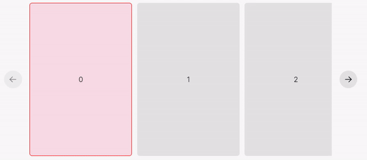

# Valence Carousel
The Valence Carousel is a custom horizontal carousel component designed for maximum usability in desktop and mobile environments. It allows a user to interact with it via the browser's native horizontal scroll, by clicking and dragging, and with the controls on either side. This component is based closely on the image carousel in the Instagram Threads app.


## Usage
```tsx
import { Carousel, CarouselChildProps } from "@valence-ui/carousel";

function Demo() { 

  return (
    <Carousel>
      <CarouselChild 
        key={i}
      />
    </Carousel>
  )
}

function CarouselChild(props: CarouselChildProps) { 
  return ( 
    <div
      style={{
        backgroundColor: props.isActive ? "red" : undefined,
        outline: props.isNearest ? "1px solid red" : undefined,
      }}
    >
      Carousel Child
    </div>
  )
}
```

This example is an uncontrolled carousel. The Carousel package does not include a default child component, instead relying on a custom component that uses the `CarouselChildProps`. `CarouselChildProps` gives the `isActive` and `isNearest` props to the child, which can be used to influence style or behaviour.

The Carousel can also be used in a controlled manner, allowing higher-level components to know and/or control the active child:

```tsx
import { Carousel, CarouselChildProps } from "@valence-ui/carousel";
import { useState } from "react";

function Demo() { 

  const [activeChild, setActiveChild] = useState(0);

  return (
    <Carousel
      activeChild={activeChild}
      setActiveChild={setActiveChild}
    >
      <CarouselChild 
        key={i}
      />
    </Carousel>
  )
}

// etc.
```

## `CarouselChildProps`
All children of the Carousel component *must* use the `CarouselChildProps`, or a React error will occur. These props supply information about the state of each child.

`isNearest` describes whether this child is the nearest to the left edge of the carousel, but is not necessarily the same as the "active" child.`isActive`, conversely, describes whether this child is focused by the carousel. 
When the user is moving the carousel (either via scrolling or dragging), both the nearest and active components are likely to be the same; the active component is usually the one that is closest to the left edge.

When scrolling all the way to the right, these two values diverge. The nearest child will always be the element closest to the left edge, however the active child may become one that is further right than the nearest one.

Additionally, the active child is "debounced" such that it does not change as frequently when scrolling.

**In short, in almost every situation, you should prefer the use of `isActive` over `isNearest`. The latter is included for completeness.**


> In this example, the outlined child is the nearest, and the pink one is active.


## Props
### Reactive props
- `allowDrag: boolean` - Whether to allow the carousel to be dragged by a user's pointer on desktop devices. `true` on desktop devices by default.
- `showScrollbar: boolean` - Whether to show the horizontal scrollbar. `false` by default.
- `snapToChildren: boolean` - Whether to snap to the nearest child when no longer scrolling or being dragged. `true` by default.
- `changeActiveOnScroll` - Whether the active child should be changed while scrolling. `true` by default.
- `showControls: boolean` - Whether to show the carousel controls. `true` by default.


### Statefulness
`activeChild` and `setActiveChild` are provided to replace the built-in `useState`, if this state is required on a higher level. `activeChild` is always an integer.

### Controls
The `controlIcons` prop accepts an object that allows the overriding of the icons on the controls. By default, these are left and right arrows from the [Tabler icons pack](https://tabler.io/icons).

```tsx
return ( 
  <Carousel
    controlIcons={{
      prev: <ReplacementPrevIcon />,
      next: <ReplacementNextIcon />,
    }}
  >
    {/** etc **/}
  </Carousel>
)
```

`controlButtonProps` are optional props to pass to both control buttons, and take the type of the [`IconButtonProps`](https://github.com/valence-dev/docs/blob/main/core/components/buttons/icon-button.md) from the Valence Core library. These can be used to override the default style and functional attributes of these buttons.

### Miscellaneous
- `contentProps: FlexProps` - Optional props to pass to the content container `Flex` component.